<div align="center">
  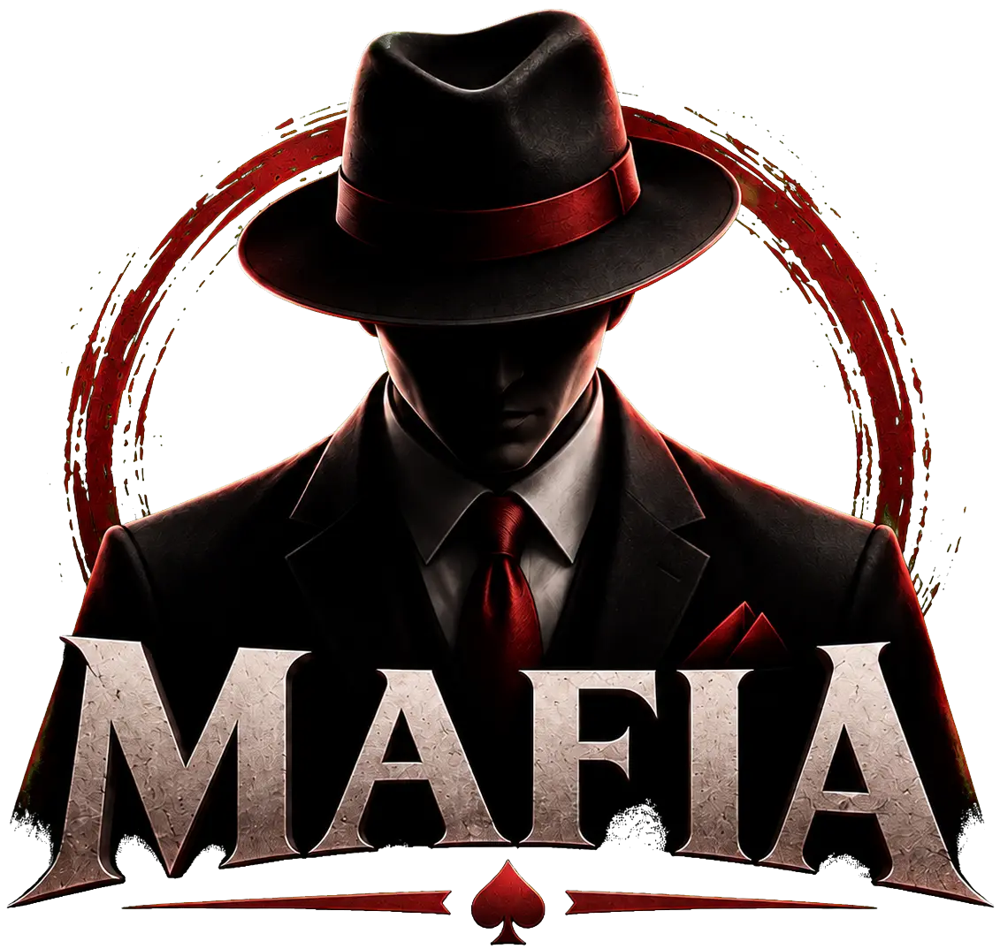

  # MAFIA

  **Доверието е лукс. Всеки има тайна.**

  Mobile-first social deduction game with a cinematic noir identity,
  built with Laravel, Blade and Bootstrap.

  [](https://laravel.com)
  [](https://www.php.net)
  [](https://getbootstrap.com)
  [](https://vite.dev)

  [За играта](#-за-играта) •
  [Функционалности](#-функционалности) •
  [Рангове](#-рангове-и-прогрес) •
  [Инсталация](#-локална-инсталация) •
  [Roadmap](#-roadmap)
</div>

---

## 🎭 За играта

**Mafia** е мобилна игра за социална дедукция, блъфиране и оцеляване. Играчите
получават скрити роли, създават съюзи и се опитват да разкрият мафията, преди да е станало
твърде късно.

Интерфейсът е проектиран първо за мобилни устройства и съчетава:

- кинематографичен Mafia noir стил;
- iOS-ориентиран mobile-first UX;
- тъмни glass компоненти и crimson акценти;
- нива, XP, рангове, мисии и постижения.

## ✨ Функционалности

### Налични

- регистрация с име, потребителско име, имейл и парола;
- вход със защитена Laravel сесия;
- качване и preview на профилна снимка;
- rate limiting на login и register заявките;
- защитена home страница с `auth` middleware;
- бърза client-side навигация между Начало, Игри, Чат и Профил;
- responsive Blade и SCSS компоненти;
- PWA/iOS meta конфигурация и application icons.

### В разработка

- създаване и присъединяване към game lobby;
- автоматично разпределяне на роли;
- нощни и дневни фази;
- гласуване и елиминации;
- чат на живо и игрови известия;
- XP, нива, рангове, дневни мисии и постижения.

## 🏆 Рангове и прогрес

XP системата изчислява нивото на играча и отключва шес визуални ранга.

| Нива | Ранг | Rank badge | Level shield | Цвят |
|:---:|---|:---:|:---:|:---:|
| 0–4 | **Новобранец** | 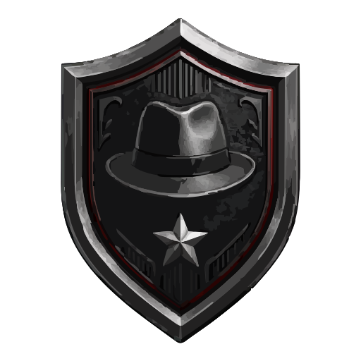 | 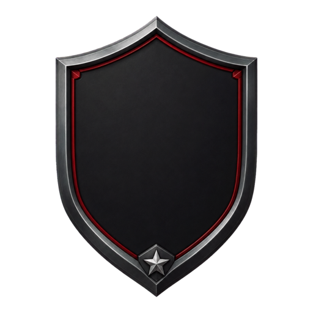 | `#8e8e93` |
| 5–9 | **Съучастник** | 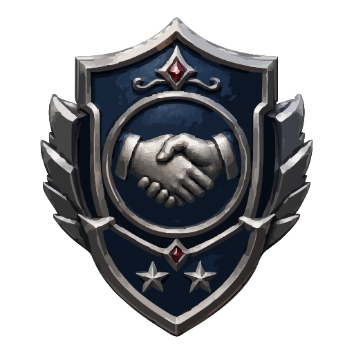 |  | `#4f8edc` |
| 10–19 | **Гангстер** | 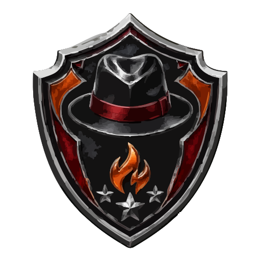 | 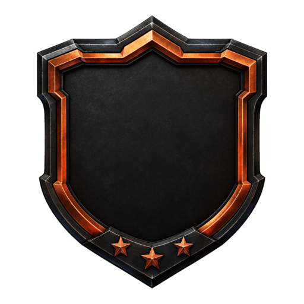 | `#dc6b2f` |
| 20–29 | **Капо** | 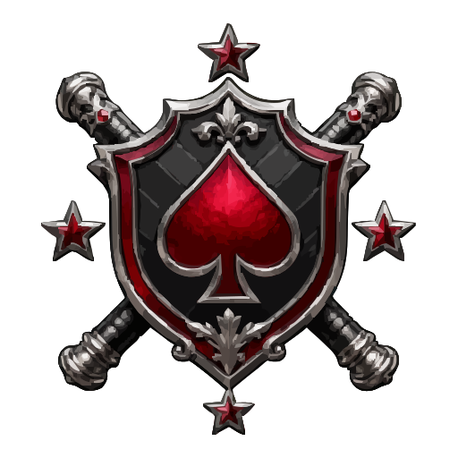 | 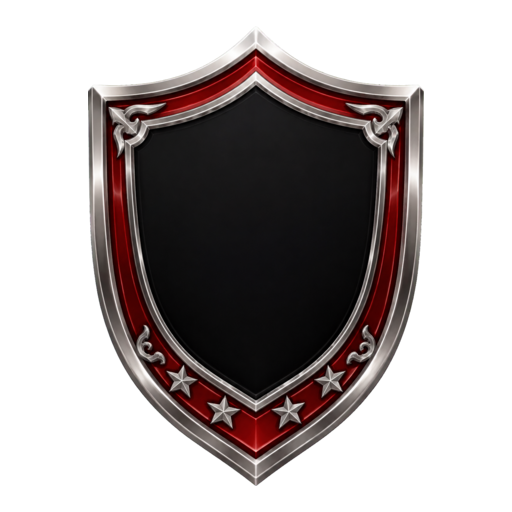 | `#d92731` |
| 30–49 | **Подземен бос** | 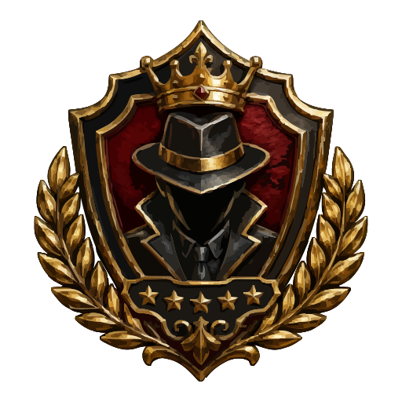 | 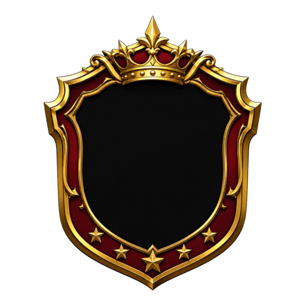 | `#d4af37` |
| 50+ | **Дон** | 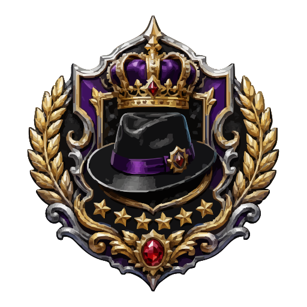 | 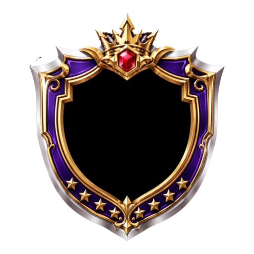 | `#9b59ff` |

> Базата данни пази общото XP. Нивото, прогресът и рангът се определят от игровата логика.

## 🎨 Визуална идентичност

<table>
  <tr>
    <th align="center">Game logo</th>
    <th align="center">Authentication logo</th>
    <th align="center">App icon</th>
    <th align="center">Favicon</th>
  </tr>
  <tr>
    <td align="center"></td>
    <td align="center">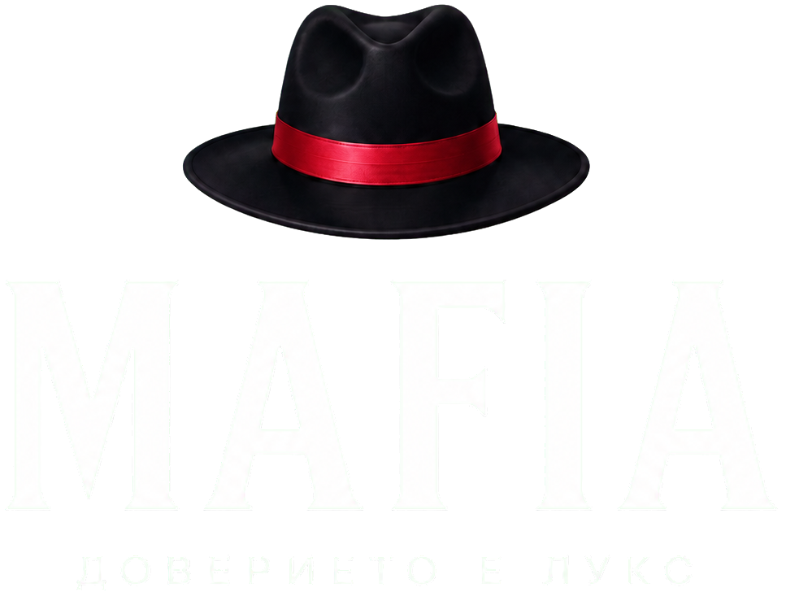</td>
    <td align="center">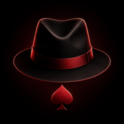</td>
    <td align="center"></td>
  </tr>
</table>

### UI icons

| Asset | Path | Purpose |
|---|---|---|
| Google | `public/img/google-icon.svg` | Google sign-in button |
| Apple | `public/img/apple-icon.svg` | Apple sign-in button |
| Rank badges | `public/img/icons/levels/` | Визуален ранг на играча |
| Level shields | `public/img/icons/level-shields/` | Рамка за динамичния номер на нивото |
| Bootstrap Icons | `bootstrap-icons` | Навигация и интерфейсни действия |

## 🧩 Технологии

| Layer | Technology |
|---|---|
| Backend | PHP 8.3+, Laravel 13 |
| Authentication | Laravel Auth, sessions, CSRF protection |
| Database | SQLite, MySQL or PostgreSQL through Eloquent ORM |
| Templates | Blade components and sections |
| UI | Bootstrap 5.3, Bootstrap Icons, custom SCSS |
| Frontend logic | JavaScript, jQuery |
| Assets | Vite 8, Sass |
| Tests | PHPUnit 12 |

## 🗂️ Структура

```text
app/
├── Http/Controllers/     # HTTP actions and authentication
├── Models/               # Eloquent models
└── Support/              # Game progression rules

resources/
├── js/                   # Client-side behaviour
├── scss/
│   ├── components/       # Header and bottom navigation
│   └── pages/            # Home and authentication styles
└── views/
    ├── components/       # Reusable Blade components
    ├── layouts/          # Base application layout
    ├── pages/            # Page shells
    └── sections/         # Home, games, chat and profile tabs

public/img/
├── icons/                # Rank badges and level shields
├── auth.png              # Authentication logo
└── game_logo.png         # Main game logo
```

## 🚀 Локална инсталация

### Изисквания

- PHP 8.3+
- Composer
- Node.js и npm
- SQLite, MySQL или PostgreSQL

### Стъпки

```bash
git clone https://github.com/PetarIliev22/mafia-game.git
cd mafia-game

composer install
cp .env.example .env
php artisan key:generate
```

Конфигурирай базата данни в `.env`, след което изпълни:

```bash
php artisan migrate
php artisan storage:link

npm install
npm run build
```

За локална разработка:

```bash
composer run dev
```

Проектът ще бъде достъпен на адреса, показан от Laravel development server.

## 🧪 Тестове

```bash
composer test
```

Проверка на кодовия стил:

```bash
./vendor/bin/pint --test
```

Автоматично форматиране:

```bash
./vendor/bin/pint
```

## 🗺️ Roadmap

- [x] Mobile-first Mafia interface
- [x] Login and registration
- [x] Profile avatar upload and preview
- [x] Protected authenticated area
- [x] Fast tab navigation
- [ ] Player XP and rank progression
- [ ] Game creation and join codes
- [ ] Lobby and ready state
- [ ] Automatic role assignment
- [ ] Day/night game engine
- [ ] Voting and elimination system
- [ ] Real-time chat and notifications
- [ ] Achievements, missions and leaderboards
- [ ] Social authentication with Google and Apple
- [ ] Automated feature tests and CI

## 🤝 Contributing

1. Fork the repository.
2. Create a feature branch: `git checkout -b feature/feature-name`.
3. Commit the changes using a clear message.
4. Push the branch and open a pull request.

## 📜 License

The project currently uses the MIT license declared in `composer.json`.

---

<div align="center">
  

  **MAFIA — Доверието е лукс.**
</div>
